# Q4-26

> Daily learning, development, AI, projects, and personal progress.

---

# 📊 Activity Dashboard

All progress is controlled from:

`progress.json`

---

## 🐍 Python

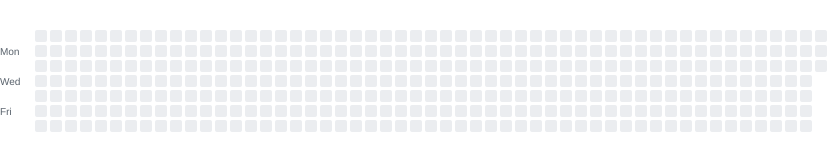

---

## 🤖 Machine Learning

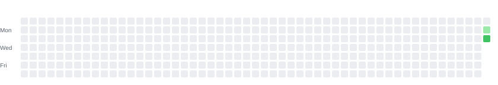

---

## 🧠 LLMs

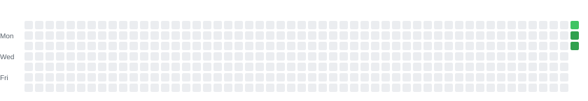

---

## 🏆 Kaggle


---

## 📊 Data Science

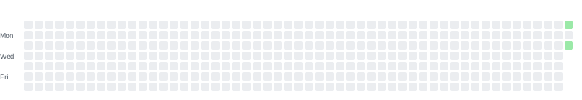

---

## 🇬🇧 English

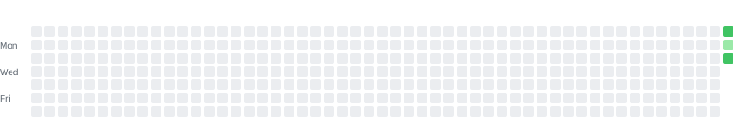

---

# 💻 Development

## 🦋 Flutter

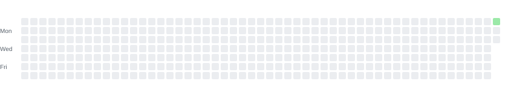

---

## 🎯 Dart


---

## ⚡ FastAPI

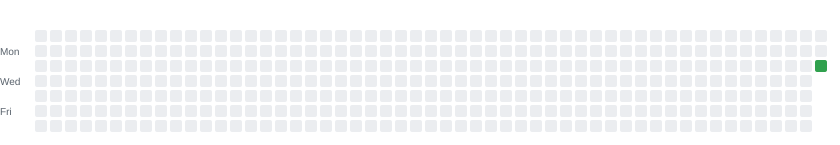

---

## 🟢 Node.js

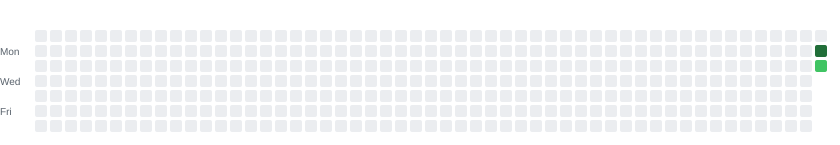

---

## 🗄️ Databases

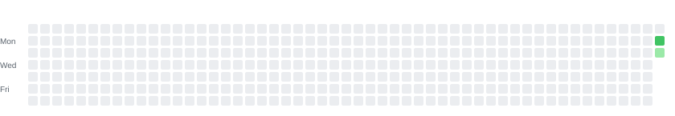

---

## 🏗️ System Design


---

# 🤖 AI

## 🔄 Transformers

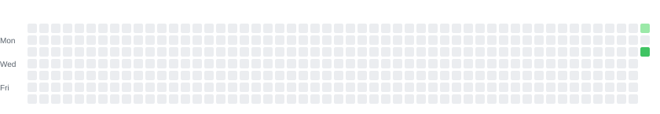

---

## 🔢 Embeddings

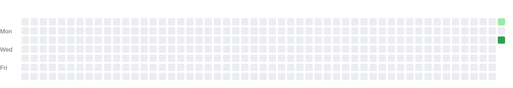

---

## 🔎 RAG


---

## 🤖 LLM Agents

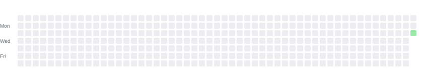

---

## 🎛️ Fine-tuning


---

## 💻 Local LLMs


---

# 📈 Progress Levels

| Level | Activity |
|---:|---|
| 0 | No activity |
| 1 | Small |
| 2 | Moderate |
| 3 | Good |
| 4 | Strong |

---

# 📝 How to Track Your Day

You only need to edit:

`progress.json`

Example:

```json
{
  "2026-09-30": {
    "python": 3,
    "kaggle": 4,
    "rag": 2,
    "english": 1
  }
}
