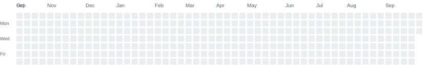

# Q4-26

> Daily learning, projects, tasks, and achievements.

---

## 📊 Daily Progress

<!-- CONTRIBUTION_GRAPH_START -->

<!-- CONTRIBUTION_GRAPH_END -->

---

## 🎯 Goals

### 📚 Learning

- [ ] [Python](#-python)
- [ ] Machine Learning
- [ ] LLMs
- [ ] Kaggle
- [ ] Data Science
- [ ] English

### 💻 Development

- [ ] Flutter
- [ ] Dart
- [ ] FastAPI
- [ ] Node.js
- [ ] Databases
- [ ] System Design

### 🤖 AI

- [ ] Transformers
- [ ] Embeddings
- [ ] RAG
- [ ] LLM Agents
- [ ] Fine-tuning
- [ ] Local LLMs

---

## 📅 Daily Tasks

### 2026-09-29

- [x] Kaggle — 30 minutes
- [x] Python practice
- [x] Mini RAG debugging
- [x] README improvement

### 2026-09-28

- [x] Damage Management System
- [x] Node.js debugging
- [x] Git practice

### 2026-09-27

- [x] Kaggle exploration
- [x] Markdown practice
- [x] Git branches

---

## 🏆 Achievements

### September 2026

- Built the Q4-26 progress tracking system.
- Started tracking daily learning activities.
- Started exploring Kaggle regularly.
- Continued working on AI/RAG projects.
- Improved Git and GitHub workflow.

---

## 📈 Progress Levels

| Level | Meaning |
|---:|---|
| 0 | No activity |
| 1 | Small progress |
| 2 | Moderate progress |
| 3 | Good progress |
| 4 | Strong progress |

---

## 🔥 Current Focus

- AI Engineering
- LLMs
- RAG
- Kaggle
- Python
- Software Engineering
- Flutter
- English

---

# 🐍 Python

---

## 📝 How to Add a New Day

Edit `progress.json`:

```json
"2026-09-30": {
  "level": 3,
  "tasks": [
    "Kaggle — 30 minutes",
    "Python practice",
    "English — 30 minutes"
  ]
}
